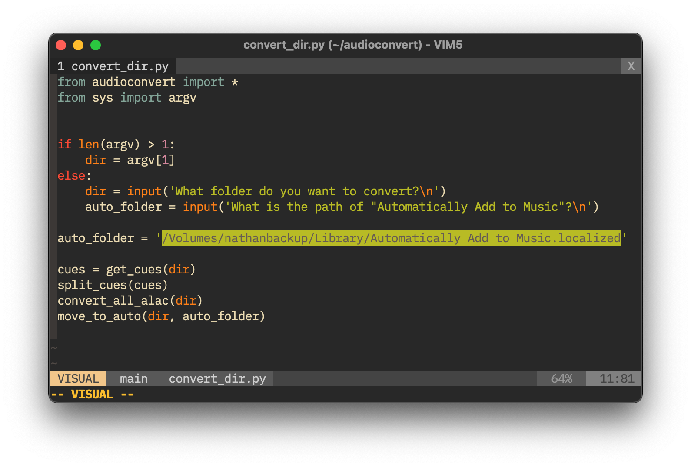
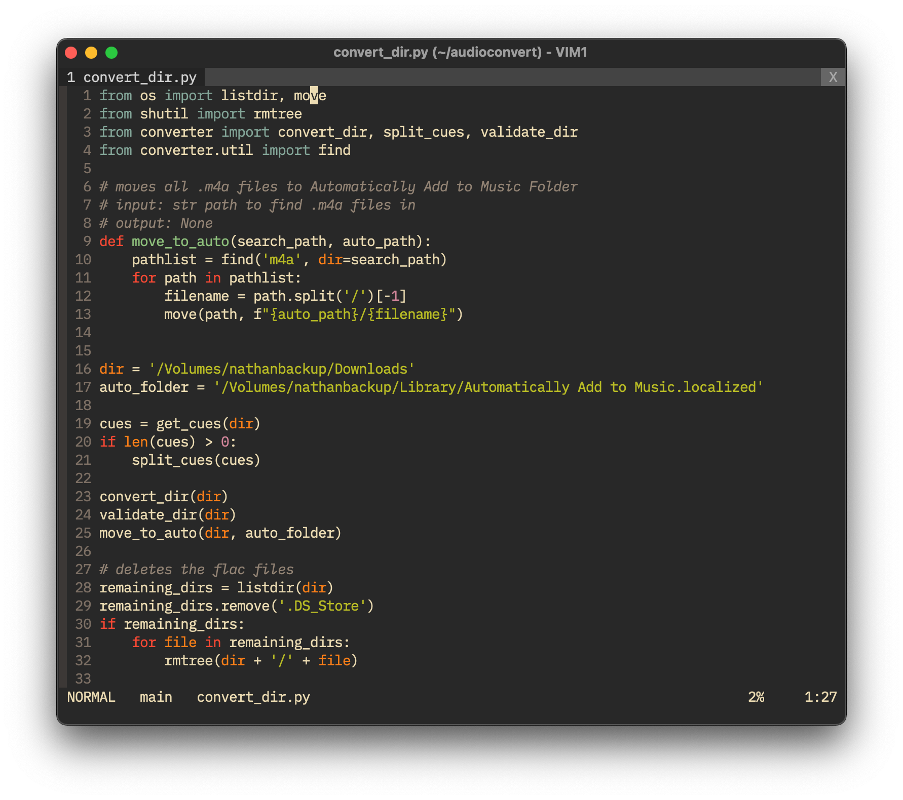

# audioconvert

**A scrappy library that tags and converts audio files to ALAC m4a. Written for those that use the macOS music app.**

### Quick start

1. Clone the repository

   ```bash
   git clone https://github.com/pynathanthomas/audioconvert.git
   ```

2. Install dependencies

   ```bash
   cd audioconvert; pip3 install -r requirements.txt
   ```

3. Open `convert_dir.py` and replace the highlighted line with your path to Automatically Add to Music.localized.

   

4. Now you can either run

   ```bash
   python3 ~/audioconvert/convert_dir.py /directory/to/convert
   ```

   or just

   ```bash
   python3 ~/audioconvert/convert_dir.py
   ```

   for the interactive mode.

5. Now the program will split cue files, convert everything to ALAC and sort it out in the Music app!


### Usage of tagger

This scrapes either [discogs](https://www.discogs.com/) or Spotify for data and tags the files automatically.

There are two options—tag an album or tag a bunch of random tracks.

**To tag an album**

```bash
python3 ~/audioconvert/tag_album.py '/path/to/album/directory'
```

You can specify to use discogs or spotify with the `-d` or `-s`  flags, respectively.

```bash
python3 ~/audioconvert/tag_album.py -d '/path/to/album/directory'
```

```bash
python3 ~/audioconvert/tag_album.py -s '/path/to/album/directory'
```

This will:

1. Search the name of the directory in discogs/spotify and get the release
2. Check if the names of the tracks match the names of the files



3. Hit enter to set the tags, type in the album name to search again, or type "n" to get the next result

The other use case for tagger is for tagging large numbers of random tracks. To do this you need to use a pattern that tells the program how the files are named.

For example, a file named `My Way - Frank Sinatra.flac` would have the pattern `$track - $artist.flac`, or a file named `Kesha - Last Goodbye (2012).m4a` would have the pattern `$artist - $track ($year).m4a`. For this to work, all files in the folder have to be named using the same pattern.

**Usage**

```bash
python3 ~/audioconvert/tag_tracks.py '/path/to/track/directory' 'pattern'
```

It will search spotify for the tracks and tag them.