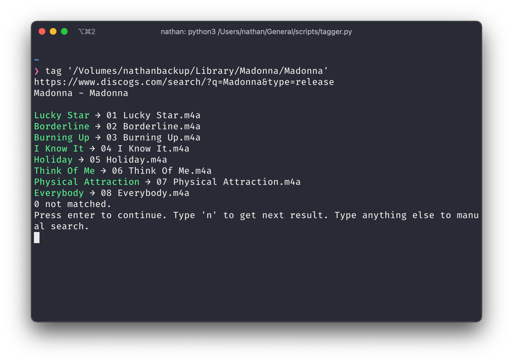

# audioconvert

**A scrappy library that tags and converts audio files to ALAC m4a. Not written for production/large scale use.**

### Usage of converter

```python
import audioconvert as a

in_dir = '/path/to/unconverted'
out_dir = '/path/to/move/converted/to'

# converts and moves wav/wv files
a.convert_wav(in_dir, out_dir)

# finds cue files and parses them
cues = a.get_cues(in_dir)
# splits track in the subfolder that the cue files were in
# tags them with metadata in the cue file
# works with anything supported by ffmpeg
a.split_cues(cues)

# I personally use this with the "Automatically Add to Music" folder on macOS
# this will move all m4a files to that
auto_folder = '/path/to/Automatically Add to Music.localized'
a.move_to_auto(out_dir, auto_folder)
```

This does not delete any files, so you may have to use `os.remove` on all the flacs after you're done.

### Usage of tagger

This scrapes [discogs](https://www.discogs.com/) for data and tags the files automatically.

**Interactive mode** in terminal

```bash
python3 tagger.py '/path/to/album/directory'
```

This will:

1. Search the name of the directory in discogs and get the release

 	2. Check if the names of the tracks match the names of the files



​	3. Hit enter to set the tags, type in the album name to search again, or type "n" to get the next result

**As a module**

```python
import tagger

path = '/path/to/abbey_road'
query = 'abbey road'
# searches query on discogs
tags = tagger.searchTags(query)

# check if the file names match, display the arrows and stuff
# optional
tagger.tryMatch(tags, path)

# associates a filepath with each track in tag dict
matched_tags, not_matched = tagger.matchTags(tags, path)

# set to True if you don't want disc numbers (A1, A2...) and just track numbers (1, 2...)
no_disc = False

# sets the tags
# will only work with matched_tags
tagger.setTags(matched_tags, no_disc)
```

